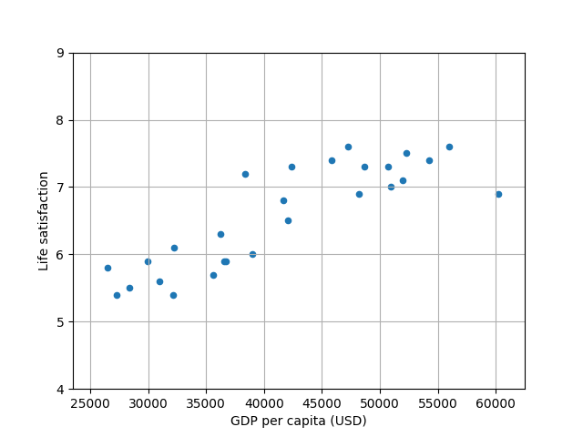
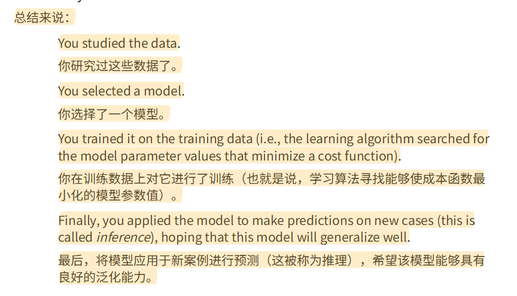

1. matplotlib.pyplot as plt：这是一个绘图库，用于创建各种图表、图形和可视化。plt是它的常用别名，可以用来绘制线图、散点图、柱状图等。

2. umpy as np：这是数值计算的基础库，提供了多维数组对象和大量数学函数。np是它的标准别名，主要用于高效的数值运算和数组操作。

3. pandas as pd：这是一个数据分析库，提供了DataFrame等数据结构，便于数据清洗、分析和处理。pd是它的常用别名，特别适合处理表格型数据。

4. LinearRegression from sklearn.linear_model：这是scikit-learn机器学习库中的线性回归模型，用于建立线性关系模型进行预测和分析。

---

```
lifesat.plot(kind='scatter',grid=True,x="GDP per capita(USD)",y="Life satisfaction")
plt.axis([23_500,62_500,4,9])
plt.show()

这一行使用pandas的plot方法创建了一个散点图(scatter plot)，其中：

kind='scatter' 指定图表类型为散点图
x="GDP per capita(USD)" 表示横轴是人均GDP数据
y="Life satisfaction" 表示纵轴是生活满意度数据
grid=True 显示网格线
```

---
## 输出结果
### 线性回归(算法)模型
```
数据集的列名:
['Country', 'GDP per capita (USD)', 'Life satisfaction']

数据集的前几行:
   Country  GDP per capita (USD)  Life satisfaction
0   Russia          26456.387938                5.8
1   Greece          27287.083401                5.4
2   Turkey          28384.987785                5.5
3   Latvia          29932.493910                5.9
4  Hungary          31007.768407                5.6
[[6.01610329]]
```


### K最近邻回归（KNN算法）模型
```
数据集的列名:
['Country', 'GDP per capita (USD)', 'Life satisfaction']

数据集的前几行:
   Country  GDP per capita (USD)  Life satisfaction
0   Russia          26456.387938                5.8
1   Greece          27287.083401                5.4
2   Turkey          28384.987785                5.5
3   Latvia          29932.493910                5.9
4  Hungary          31007.768407                5.6
[[5.73333333]]
```


---
我们可以看到线性回归预测：6.016，KNN预测：5.733；
明明是同一组数据，两个模式（算法）却给出了不同的预测结果，这表明这两个算法之间存在差异，我们在训练数据时需要根据具体数据进行选择。
那么线性回归和KNN算法之间有什么区别呢？
1. 线性回归（Linear Regression）
假设关系是“线性的”，我们可以看到生成的图片中散点图，线性回归就是将这些散点假设（近似）在一条直线上，再用函数“y=wx+b”这种形式来说明关系并预测。但实际上这些散点并不完全在直线上，只是假设或近似；
特点：
   简单、可解释性强
   对数据要求：接近直线关系
   外推能力强（可以预测未见范围）

2. KNN 回归（K-Nearest Neighbors）
不是通过数学建模（函数）形式，而是直接“看邻居”，只找离我们最近的K个数据，然后对这K个数据进行平均，得到预测结果，从散点图中就能看出来。
特点：
   找最近的 K 个点 → 平均
   不需要训练（惰性学习）
   非线性能力强
   对数据分布非常敏感

---

| 维度     | 线性回归   | KNN      |
| ------ | ------ | -------- |
| 模型类型   | 参数模型   | 非参数模型    |
| 是否假设关系 | ✅ 线性假设 | ❌ 不假设    |
| 对数据要求  | 关系要“直” | 数据要“密”   |
| 泛化能力   | 强      | 弱（容易过拟合） |

**这里面有提到参数模型和非参数模型，这两个是什么呢？**
```
参数模型：简单理解就是像函数一样，有参数，比如 y=wx+b，w和b就是参数，通过参数来确定关系，比如w=1，b=0，那么关系就是 y=x。
非参数模型：简单理解就是没有参数，比如KNN算法，通过K（是真实）个数据来预测结果，KNN算法本身没有参数，只是通过K个数据来预测结果。

参数模型 = 用“少量参数”概括整个数据规律（用固定数量参数描述数据（如线性回归））
非参数模型 = 不压缩数据，直接用数据本身做决策（不预设参数形式，直接依赖数据本身（如 KNN））
```
**什么是拟合，泛化，过拟合和欠拟合？**

👉 模型学习的全过程其实就是：

> **拟合训练数据 → 希望泛化到新数据 → 可能过拟合或欠拟合**

---

# 1️⃣ 拟合（Fitting）

👉 最基础的动作：

> 模型去“贴合”训练数据

比如线性回归在做的事就是：

$$y=wx+b$$

👉 找一条线，让它尽量靠近所有点

---

✅ 重点：

* 拟合 ≠ 好或坏
* 它只是一个**过程**

---

# 2️⃣ 泛化（Generalization）

👉 真正的目标：

> 模型在“没见过的数据”上也能表现好

---

✅ 判断标准：

* 不是看训练集
* 是看测试集（新数据）

---

# 🔗 到这里的关系是：

👉 **拟合是手段，泛化是目的**

---

# 3️⃣ 过拟合（Overfitting）

👉 拟合“过头了”

> 模型不仅学到了规律，还把“噪声”也学进去了

---

## 📌 特征

* 训练集：表现很好（甚至完美）
* 测试集：表现很差

---

## 🧠 直觉理解

👉 就像：

> 把答案背下来了，而不是理解

---

## 📍 在你学的模型里

* KNN（K=1）就是典型过拟合

---

# 4️⃣ 欠拟合（Underfitting）

👉 拟合“不够”

> 模型太简单，连基本规律都没学到

---

## 📌 特征

* 训练集：表现差
* 测试集：也差

---

## 🧠 直觉理解

👉 就像：

> 连基础知识都没学会

---

# 🎯 四个概念一口气串起来

👉 核心逻辑是：

```
模型训练 → 拟合数据
           ↓
     看能不能泛化
           ↓
   ┌───────────────┐
   │               │
泛化好         泛化差
   │               │
正常模型     ┌────────────┐
            │            │
        过拟合        欠拟合
```

---

# 📊 用一个表帮你彻底区分

| 状态      | 训练集表现 | 测试集表现 | 本质问题  |
| ------- | ----- | ----- | ----- |
| 正常（泛化好） | 好     | 好     | 学到了规律 |
| 过拟合     | 非常好   | 差     | 学了噪声  |
| 欠拟合     | 差     | 差     | 模型太弱  |

---

# 💡 一句话终极理解

👉

* 拟合：在学
* 泛化：学得好不好（对新数据）
* 过拟合：学太细（连噪声都学）
* 欠拟合：没学会

---

# 🚀 再帮你拔高一层

👉 所有机器学习问题，本质就是：

> **在“欠拟合”和“过拟合”之间找平衡**


## 读书笔记

```
也就是说，有一堆看似毫无规律的数据，我们通过各种算法进行操作来达到我们想要的看到的东西，并且能够应用于其他类似的数据中（找到想要的东西）；这样的一系列操作被称为数据训练.
```