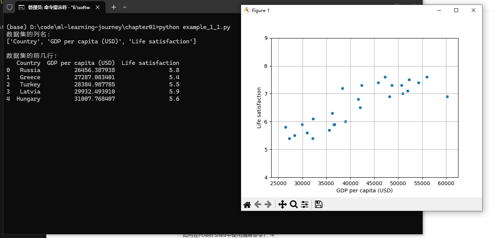

1. matplotlib.pyplot as plt：这是一个绘图库，用于创建各种图表、图形和可视化。plt是它的常用别名，可以用来绘制线图、散点图、柱状图等。

2. umpy as np：这是数值计算的基础库，提供了多维数组对象和大量数学函数。np是它的标准别名，主要用于高效的数值运算和数组操作。

3. pandas as pd：这是一个数据分析库，提供了DataFrame等数据结构，便于数据清洗、分析和处理。pd是它的常用别名，特别适合处理表格型数据。

4. LinearRegression from sklearn.linear_model：这是scikit-learn机器学习库中的线性回归模型，用于建立线性关系模型进行预测和分析。

---

```
lifesat.plot(kind='scatter',grid=True,x="GDP per capita(USD)",y="Life satisfaction")
plt.axis([23_500,62_500,4,9])
plt.show()

这一行使用pandas的plot方法创建了一个散点图(scatter plot)，其中：

kind='scatter' 指定图表类型为散点图
x="GDP per capita(USD)" 表示横轴是人均GDP数据
y="Life satisfaction" 表示纵轴是生活满意度数据
grid=True 显示网格线
```

---
## 输出结果
