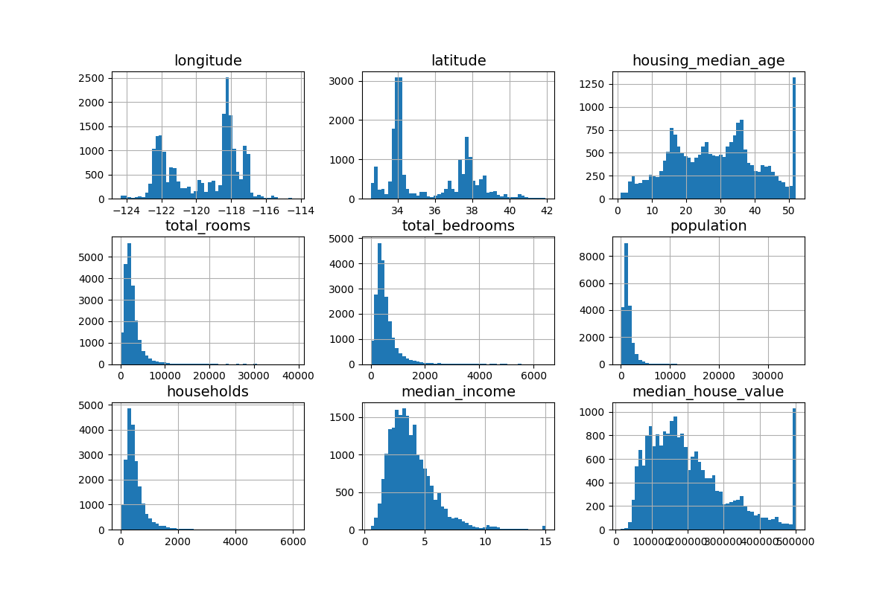

```
ml_housing_corp的前5行输出：
   longitude  latitude  housing_median_age  total_rooms  ...  households  median_income  median_house_value  ocean_proximity
0    -122.23     37.88                41.0        880.0  ...       126.0         8.3252            452600.0         NEAR BAY
1    -122.22     37.86                21.0       7099.0  ...      1138.0         8.3014            358500.0         NEAR BAY
2    -122.24     37.85                52.0       1467.0  ...       177.0         7.2574            352100.0         NEAR BAY
3    -122.25     37.85                52.0       1274.0  ...       219.0         5.6431            341300.0         NEAR BAY
4    -122.25     37.85                52.0       1627.0  ...       259.0         3.8462            342200.0         NEAR BAY

[5 rows x 10 columns]


数据结构：
<class 'pandas.core.frame.DataFrame'>
RangeIndex: 20640 entries, 0 to 20639
Data columns (total 10 columns):
 #   Column              Non-Null Count  Dtype
---  ------              --------------  -----
 0   longitude           20640 non-null  float64
 1   latitude            20640 non-null  float64
 2   housing_median_age  20640 non-null  float64
 3   total_rooms         20640 non-null  float64
 4   total_bedrooms      20433 non-null  float64
 5   population          20640 non-null  float64
 6   households          20640 non-null  float64
 7   median_income       20640 non-null  float64
 8   median_house_value  20640 non-null  float64
 9   ocean_proximity     20640 non-null  object
dtypes: float64(9), object(1)
memory usage: 1.6+ MB
None

类别：
ocean_proximity
<1H OCEAN     9136
INLAND        6551
NEAR OCEAN    2658
NEAR BAY      2290
ISLAND           5
Name: count, dtype: int64

数值属性总结：
          longitude      latitude  ...  median_income  median_house_value
count  20640.000000  20640.000000  ...   20640.000000        20640.000000
mean    -119.569704     35.631861  ...       3.870671       206855.816909
std        2.003532      2.135952  ...       1.899822       115395.615874
min     -124.350000     32.540000  ...       0.499900        14999.000000
25%     -121.800000     33.930000  ...       2.563400       119600.000000
50%     -118.490000     34.260000  ...       3.534800       179700.000000
75%     -118.010000     37.710000  ...       4.743250       264725.000000
max     -114.310000     41.950000  ...      15.000100       500001.000000

[8 rows x 9 columns]
```
> 直方图理解：

你提供的这张图展示了加州住房数据集（California Housing Dataset）中各个特征的分布情况。这类直方图是机器学习数据探索（EDA）阶段的经典步骤。

以下是从图中可以读出的几个关键信息：

### 1. 数据的尺度与范围（Scaling）
* **各特征量级差异巨大**：比如 `median_income`（中位数收入）大多在 0 到 15 之间，而 `population`（人口）则可以达到 30,000 以上。
* **结论**：在建模之前，通常需要进行**特征缩放**（如标准化或归一化），否则量级大的特征会主导模型。

### 2. 特征分布的偏态（Skewness）
* **右偏分布（重尾分布）**：`total_rooms`、`total_bedrooms`、`population`、`households` 和 `median_income` 都表现出明显的**右偏**（尾巴向右延伸）。
* **结论**：许多机器学习算法在处理正态分布的数据时效果更好。对于这些右偏特征，后续可能需要进行**对数转换（Log Transformation）**来使其分布更集中。

### 3. 数据截断/封顶（Data Capping）
这是图中非常值得注意的异常现象：
* **`housing_median_age`** 和 **`median_house_value`**：这两张图的最右端都有一个很高的“尖峰”。
* **含义**：这说明数据在收集时设置了上限。例如，所有超过 50 年的房子都被统一记为 50 年；所有超过 500,000 美元的房价都被统一记为 500,000。
* **风险**：如果你预测的目标是房价，模型可能会学习到一个错误的上限，导致无法准确预测昂贵的房产。

### 4. 地理分布特征
* **`longitude`（经度）** 和 **`latitude`（纬度）**：呈现出明显的“双峰”分布。
* **含义**：这反映了加利福尼亚州的人口分布特征——两个高峰分别对应着该州的两大人口密集区：**大洛杉矶地区**和**旧金山湾区**。

---

### 总结建议
如果正在准备用这些数据跑模型，接下来的步骤通常包括：
1.  **处理上限值**：考虑是否剔除房价达到 50w 的样本，以免误导模型。
2.  **特征变换**：对 `total_rooms` 等偏态严重的特征尝试取对数。
3.  **属性组合**：例如，“房间总数”本身意义不大，你可以创建新特征，如 `rooms_per_household`（人均房间数），这类特征通常与房价相关性更高。

这些直方图反映了真实世界数据的“不完美”，而这些不完美正是特征工程需要解决的核心问题。