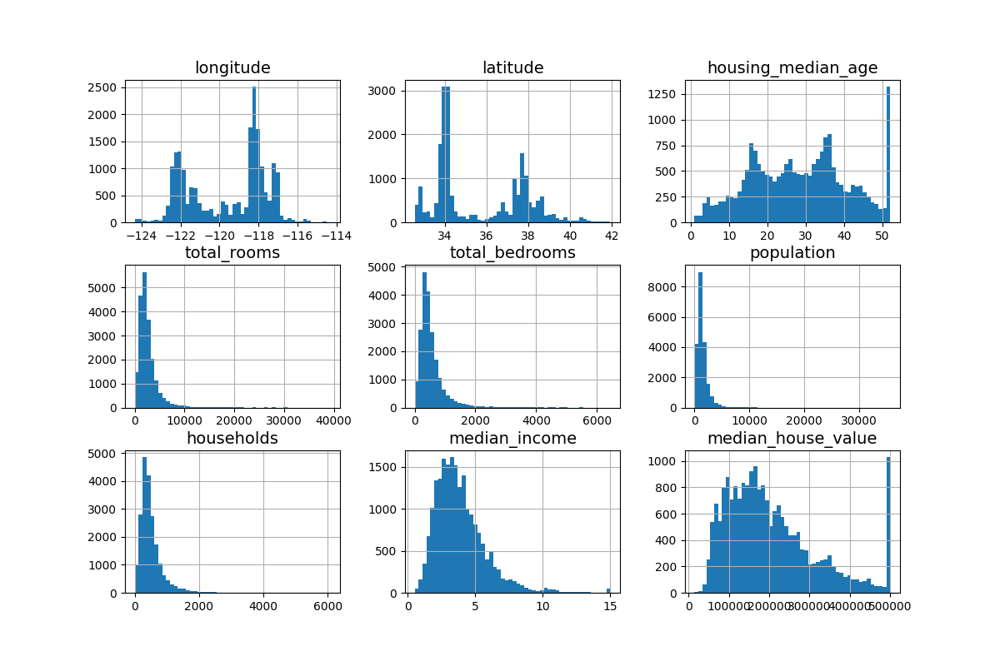
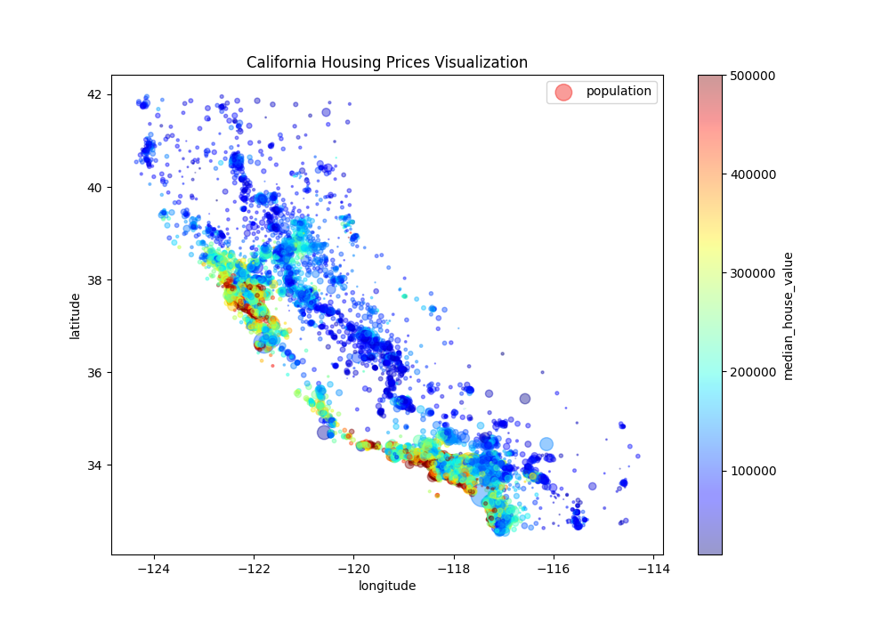

```
ml_housing_corp的前5行输出：
   longitude  latitude  housing_median_age  total_rooms  ...  households  median_income  median_house_value  ocean_proximity
0    -122.23     37.88                41.0        880.0  ...       126.0         8.3252            452600.0         NEAR BAY
1    -122.22     37.86                21.0       7099.0  ...      1138.0         8.3014            358500.0         NEAR BAY
2    -122.24     37.85                52.0       1467.0  ...       177.0         7.2574            352100.0         NEAR BAY
3    -122.25     37.85                52.0       1274.0  ...       219.0         5.6431            341300.0         NEAR BAY
4    -122.25     37.85                52.0       1627.0  ...       259.0         3.8462            342200.0         NEAR BAY

[5 rows x 10 columns]


数据结构：
<class 'pandas.core.frame.DataFrame'>
RangeIndex: 20640 entries, 0 to 20639
Data columns (total 10 columns):
 #   Column              Non-Null Count  Dtype
---  ------              --------------  -----
 0   longitude           20640 non-null  float64
 1   latitude            20640 non-null  float64
 2   housing_median_age  20640 non-null  float64
 3   total_rooms         20640 non-null  float64
 4   total_bedrooms      20433 non-null  float64
 5   population          20640 non-null  float64
 6   households          20640 non-null  float64
 7   median_income       20640 non-null  float64
 8   median_house_value  20640 non-null  float64
 9   ocean_proximity     20640 non-null  object
dtypes: float64(9), object(1)
memory usage: 1.6+ MB
None

类别：
ocean_proximity
<1H OCEAN     9136
INLAND        6551
NEAR OCEAN    2658
NEAR BAY      2290
ISLAND           5
Name: count, dtype: int64

数值属性总结：
          longitude      latitude  ...  median_income  median_house_value
count  20640.000000  20640.000000  ...   20640.000000        20640.000000
mean    -119.569704     35.631861  ...       3.870671       206855.816909
std        2.003532      2.135952  ...       1.899822       115395.615874
min     -124.350000     32.540000  ...       0.499900        14999.000000
25%     -121.800000     33.930000  ...       2.563400       119600.000000
50%     -118.490000     34.260000  ...       3.534800       179700.000000
75%     -118.010000     37.710000  ...       4.743250       264725.000000
max     -114.310000     41.950000  ...      15.000100       500001.000000

[8 rows x 9 columns]
```
> 直方图理解：

你提供的这张图展示了加州住房数据集（California Housing Dataset）中各个特征的分布情况。这类直方图是机器学习数据探索（EDA）阶段的经典步骤。

以下是从图中可以读出的几个关键信息：

### 1. 数据的尺度与范围（Scaling）
* **各特征量级差异巨大**：比如 `median_income`（中位数收入）大多在 0 到 15 之间，而 `population`（人口）则可以达到 30,000 以上。
* **结论**：在建模之前，通常需要进行**特征缩放**（如标准化或归一化），否则量级大的特征会主导模型。

### 2. 特征分布的偏态（Skewness）
* **右偏分布（重尾分布）**：`total_rooms`、`total_bedrooms`、`population`、`households` 和 `median_income` 都表现出明显的**右偏**（尾巴向右延伸）。
* **结论**：许多机器学习算法在处理正态分布的数据时效果更好。对于这些右偏特征，后续可能需要进行**对数转换（Log Transformation）**来使其分布更集中。

### 3. 数据截断/封顶（Data Capping）
这是图中非常值得注意的异常现象：
* **`housing_median_age`** 和 **`median_house_value`**：这两张图的最右端都有一个很高的“尖峰”。
* **含义**：这说明数据在收集时设置了上限。例如，所有超过 50 年的房子都被统一记为 50 年；所有超过 500,000 美元的房价都被统一记为 500,000。
* **风险**：如果你预测的目标是房价，模型可能会学习到一个错误的上限，导致无法准确预测昂贵的房产。

### 4. 地理分布特征
* **`longitude`（经度）** 和 **`latitude`（纬度）**：呈现出明显的“双峰”分布。
* **含义**：这反映了加利福尼亚州的人口分布特征——两个高峰分别对应着该州的两大人口密集区：**大洛杉矶地区**和**旧金山湾区**。

---

### 总结建议
如果正在准备用这些数据跑模型，接下来的步骤通常包括：
1.  **处理上限值**：考虑是否剔除房价达到 50w 的样本，以免误导模型。
2.  **特征变换**：对 `total_rooms` 等偏态严重的特征尝试取对数。
3.  **属性组合**：例如，“房间总数”本身意义不大，你可以创建新特征，如 `rooms_per_household`（人均房间数），这类特征通常与房价相关性更高。

这些直方图反映了真实世界数据的“不完美”，而这些不完美正是特征工程需要解决的核心问题。

---

# 分层抽样
运行stratified_sampling.py返回的结果：
```
             Overall  Stratified
income_cat
1           0.039826    0.039971
2           0.318847    0.318798
3           0.350581    0.350533
4           0.176308    0.176357
5           0.114438    0.114341
```
> 分层抽样理解：分层抽样后，测试集中各收入分组的比例与整体数据几乎一致，说明抽样过程成功保持了数据分布的一致性，从而保证了模型评估的可靠性。

# 数据可视化

> 数据可视化理解：从这张图可以比较清晰地看出房价和人口密度以及地理位置有着密切的关系。

# 相关性
运行correlation.py返回的结果：
```
median_house_value    1.000000
median_income         0.688075
total_rooms           0.134153
housing_median_age    0.105623
households            0.065843
total_bedrooms        0.049686
population           -0.024650
longitude            -0.045967
latitude             -0.144160
Name: median_house_value, dtype: float64
```
> 相关性理解：
```
✔ 正相关（> 0）
median_income ↑ → 房价 ↑
✔ 负相关（< 0）
latitude ↑ → 房价 ↓（北部更便宜）
✔ 接近 0
基本没线性关系
```
相关系数在-1到1之间。当它接近1时，表示正相关关系很强。例如，房屋价值会随着收入的增加而上升；当系数接近-1时，说明存在很强的负相关关系。<br/>
重要：通过计算 Pearson correlation matrix，可以快速识别与目标变量最线性相关的特征，为后续特征选择和模型构建提供依据。


# 组合特征
运行combine_feature.py返回的结果：
```
median_house_value          1.000000
median_income               0.688355
rooms_per_household         0.151344
total_rooms                 0.133294
housing_median_age          0.106432
households                  0.064894
total_bedrooms              0.049686
population_per_household   -0.023639
population                 -0.025300
longitude                  -0.045398
latitude                   -0.144638
bedrooms_per_room          -0.255880
Name: median_house_value, dtype: float64
```
> 组合特征理解：通过构造比率类特征（如 rooms_per_household），可以将原始特征转换为更具语义的信息表达，从而提升模型对数据结构的理解能力。

# 📌 三个组合特征的意义

---

## ① rooms_per_household

$$
rooms\_per\_household = \frac{total\_rooms}{households}
$$

👉 平均每户房间数

✔ 反映“房屋规模”

---

## ② bedrooms_per_room

$$
bedrooms\_per\_room = \frac{total\_bedrooms}{total\_rooms}
$$

👉 卧室占比

✔ 反映“房子结构（紧凑 or 豪华）”

---

## ③ population_per_household

$$
population\_per\_household = \frac{population}{households}
$$

👉 每户平均人口

✔ 反映“居住密度”

---

# 🔥 为什么要做组合特征？

这是机器学习里的一个核心思想：

> ❗ 原始特征 ≠ 最优表达

---

## 📊 举个直觉例子

| 原始特征 | 问题 |
|----------|------|
| total_rooms | 不知道“房子大小” |
| households | 不知道“每户情况” |

---

## ✨ 组合后的优势

- 更“语义化”的表达
- 信息更密集
- 更容易被模型学习
- 往往能提升效果

# 数据清洗
运行data_cleaning.py返回的结果：
```
longitude               0
latitude                0
housing_median_age      0
total_rooms             0
total_bedrooms        207
population              0
households              0
median_income           0
median_house_value      0
ocean_proximity         0
dtype: int64
各特征中位数：
[-1.1849e+02  3.4260e+01  2.9000e+01  2.1270e+03  4.3500e+02  1.1660e+03
  4.0900e+02  3.5348e+00  1.7970e+05]
longitude             0
latitude              0
housing_median_age    0
total_rooms           0
total_bedrooms        0
population            0
households            0
median_income         0
median_house_value    0
dtype: int64
   longitude  latitude  housing_median_age  ...  households  median_income  median_house_value
0    -122.23     37.88                41.0  ...       126.0         8.3252            452600.0
1    -122.22     37.86                21.0  ...      1138.0         8.3014            358500.0
2    -122.24     37.85                52.0  ...       177.0         7.2574            352100.0
3    -122.25     37.85                52.0  ...       219.0         5.6431            341300.0
4    -122.25     37.85                52.0  ...       259.0         3.8462            342200.0
```
>数据清洗理解：
用 sklearn 的 Transformer（SimpleImputer）替代手动数据清洗，实现可复用的数据预处理管道。<br/>
❗ 训练集 fit，测试集 transform（不能重新 fit），否则会 数据泄露（data leakage）<br/>
使用 SimpleImputer(strategy="median") 后，模型成功学习各数值特征的中位数，并将 total_bedrooms 的 207 个缺失值全部用中位数填充，实现了完整的数据清洗。<br/>

📌 缺失值处理三种方式
* 删除样本（数据少时不推荐）
* 删除特征（信息损失大）
* 填充（均值 / 中位数 / 模型预测）⭐推荐<br/>

🚀 SimpleImputer 核心点
* fit()：计算每列统计量（如中位数）
* transform()：用统计量填充缺失值
* strategy="median"：抗异常值更强（比 mean 更稳）

---

# 文本预处理
运行text_processing.py返回的结果：
```
  ocean_proximity
0        NEAR BAY
1        NEAR BAY
2        NEAR BAY
3        NEAR BAY
4        NEAR BAY
5        NEAR BAY
6        NEAR BAY
7        NEAR BAY
8        NEAR BAY
9        NEAR BAY
One-hot编码结果（稀疏矩阵）：
<Compressed Sparse Row sparse matrix of dtype 'float64'
        with 10 stored elements and shape (10, 5)>
  Coords        Values
  (0, 3)        1.0
  (1, 3)        1.0
  (2, 3)        1.0
  (3, 3)        1.0
  (4, 3)        1.0
  (5, 3)        1.0
  (6, 3)        1.0
  (7, 3)        1.0
  (8, 3)        1.0
  (9, 3)        1.0
类别列表：
[array(['<1H OCEAN', 'INLAND', 'ISLAND', 'NEAR BAY', 'NEAR OCEAN'],
      dtype=object)]
```
> 文本预处理理解：采用one-hot编码，将类别特征转换为数值特征。<br/>
OneHotEncoder 将类别变量展开为独立维度的二进制特征，并用稀疏矩阵高效存储，从而避免了 Ordinal 编码引入的虚假顺序问题。

👉 特点：
* 无偏序关系
* 更符合真实语义
* 适用于线性模型 & 神经网络

📌 稀疏矩阵（Sparse Matrix）解释
`housing_cat_1hot 是 scipy sparse matrix`

👉 为什么不是普通数组？<br/>
因为：
* 绝大多数是 0
* 如果用 numpy 存 → 浪费内存

✔ 所以 sklearn 自动优化成：
* 稀疏矩阵（只存非零位置）
---
# 自定义转换器(Custom Transformers)
运行custom_transformers.py的结果：
```
add_bedrooms_per_room=False：
[[-122.23 37.88 41.0 ... 'NEAR BAY' 6.984126984126984 2.5555555555555554]
 [-122.22 37.86 21.0 ... 'NEAR BAY' 6.238137082601054 2.109841827768014]
 [-122.24 37.85 52.0 ... 'NEAR BAY' 8.288135593220339 2.8022598870056497]
 ...
 [-121.22 39.43 17.0 ... 'INLAND' 5.20554272517321 2.325635103926097]
 [-121.32 39.43 18.0 ... 'INLAND' 5.329512893982808 2.1232091690544412]
 [-121.24 39.37 16.0 ... 'INLAND' 5.254716981132075 2.616981132075472]]


add_bedrooms_per_room=True
[[-122.23 37.88 41.0 ... 6.984126984126984 2.5555555555555554
  0.14659090909090908]
 [-122.22 37.86 21.0 ... 6.238137082601054 2.109841827768014
  0.15579659106916466]
 [-122.24 37.85 52.0 ... 8.288135593220339 2.8022598870056497
  0.12951601908657123]
 ...
 [-121.22 39.43 17.0 ... 5.20554272517321 2.325635103926097
  0.21517302573203195]
 [-121.32 39.43 18.0 ... 5.329512893982808 2.1232091690544412
  0.21989247311827956]
 [-121.24 39.37 16.0 ... 5.254716981132075 2.616981132075472
  0.22118491921005387]]
```
>自定义转换器的理解：设置 add_bedrooms_per_room=True 后，模型新增了“卧室占比”这一比例特征，它能更好地反映房屋结构（紧凑或宽敞），通常比原始特征具有更强的表达能力，从而提升模型效果。

---
# 📌 特征缩放（Feature Scaling）

---

## ✅ ① Min-Max Scaling（归一化）

把数据压缩到一个区间（通常是 [0, 1]）

$$
x' = \frac{x - x_{min}}{x_{max} - x_{min}}
$$

---

### 📌 特点

- 所有值 ∈ [0, 1]
- 保留原始分布形状

---

### ✔ 优点

- 直观
- 适合神经网络（输入范围统一）

---

### ❗ 缺点

- 对异常值（outliers）非常敏感
  - 一个极大值会“压扁”其他数据

---

## ✅ ② Standardization（标准化 / Z-score）

让数据变成：

- 均值 = 0  
- 方差 = 1  

$$
x' = \frac{x - \mu}{\sigma}
$$

---

### 📌 特点

- 数据围绕 0 分布
- 分布形状不变（只是平移+缩放）

---

### ✔ 优点（⭐ 更常用）

- 对异常值相对不敏感
- 适用于大多数机器学习模型
  - 线性回归
  - 逻辑回归
  - SVM
  - 神经网络

---

### 📌 总结对比

| 方法 | 范围 | 是否怕异常值 | 常用场景 |
|------|------|--------------|----------|
| Min-Max Scaling | [0,1] | ❌ 很敏感 | 神经网络 |
| Standardization | 无固定范围 | ✔ 相对稳定 | 大多数 ML |
