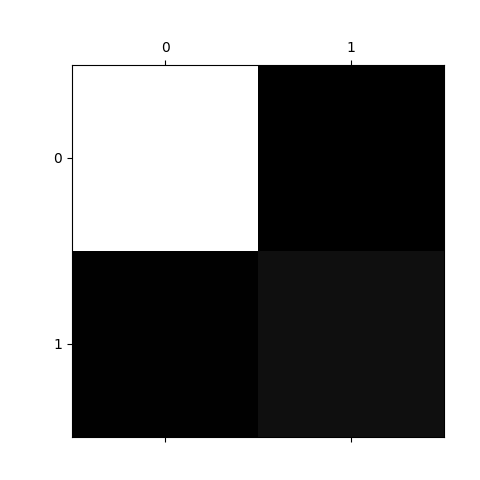
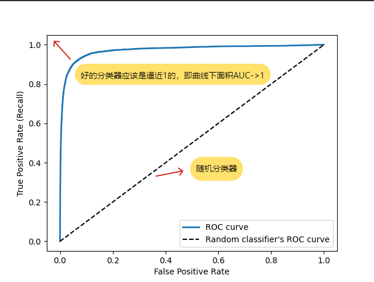
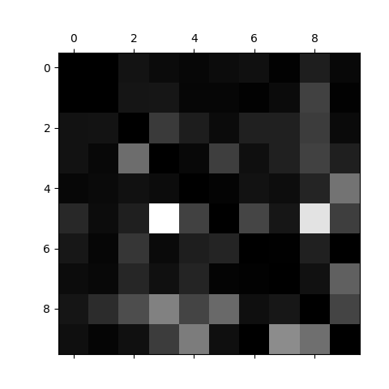

# Accuracy Using Cross-Validation利用交叉验证测量准确性
运行train_a_binary_classifier.pyd的结果（交叉验证计算 Accuracy）：
```
[0.9578  0.9651  0.97005]
Accuracy: 0.9643166666666666
```
**注意：**
这里面Accuracy: 0.9643166666666666不是表示“模型很强啊！已经96%了！”，是表示“不是5”占96%的概率。是“5”的概率是4.03%。因为是基于MNIST 二分类问题是：“是不是 5？”的

---

# Precision and Recall(Confusion Matrices 混淆矩阵)
运行train_a_binary_classifier.pyd的结果：
```
[[53657   922]
 [ 1324  4097]]
```

```
             预测
           0(False)   1(True)
真实 0        TN         FP
真实 1        FN         TP
```
---

# 📊 Precision & Recall（精确率与召回率）

---

## 📌 1. Precision（精确率）

👉 含义：
“在所有预测为 5 的样本中，有多少是真的 5？”

---

### 📐 公式

$$
Precision = \frac{TP}{TP + FP}
$$

---

### 📊 代入计算

$$
Precision = \frac{4097}{4097 + 922}
$$

$$
Precision \approx 0.816
$$

---

### 🧠 解释

👉 ≈ **81.6%**

模型预测为“5”的样本中，有 **81% 是正确的**

* ✔ 说明：预测质量还可以
* ❌ 仍然存在误报（FP）

---

## 📌 2. Recall（召回率）

👉 含义：
“在所有真实的 5 中，有多少被模型找出来？”

---

### 📐 公式

$$
Recall = \frac{TP}{TP + FN}
$$

---

### 📊 代入计算

$$
Recall = \frac{4097}{4097 + 1324}
$$

$$
Recall \approx 0.756
$$

---

### 🧠 解释

👉 ≈ **75.6%**

所有真实的 5 中，只找出了 **75%**

* ❗说明：漏掉约 **25% 的 5（FN）**

---

## 🚨 3. 关键结论

你的模型表现：

* ✔ Precision ≈ 81.6% → 预测“5”时比较可靠
* ❌ Recall ≈ 75.6% → 漏掉较多真实“5”

---

## 📉 4. 对比 Accuracy（准确率）

$$
Accuracy \approx 0.95
$$

---

### ⚠️ 重要问题

虽然 Accuracy 很高：

* ❗仍然漏掉约 **25% 的 5**

👉 说明：

💥 **Accuracy 无法反映类别不均衡问题**

---

## 🧠 一句话总结

* Precision → “预测对不对”
* Recall → “有没有漏掉”

---

# Precision(精确率) & Recall（召回率）
运行train_a_binary_classifier.pyd的结果：
```
Precision: 0.6461647727272727
Recall: 0.8391440693598967
```
# 📊 Precision & Recall 结果解读

---

## 🧠 1. 一句话总结

👉 你的模型：

> “找得很全，但有点乱说”

---

## 🔵 2. Recall = 0.839（很高）

$$
Recall = \frac{TP}{TP + FN}
$$

### 含义：

$$
Recall \approx 0.839
$$

👉 在所有真实的“5”里，你找到了 **83.9%**

✔ 说明：

* FN（漏掉的5）较少
* 模型“比较积极”

📌 直觉：

> 宁可多抓，也不漏掉

---

## 🔴 3. Precision = 0.646（偏低）

$$
Precision = \frac{TP}{TP + FP}
$$

### 含义：

$$
Precision \approx 0.646
$$

👉 你预测为“5”的里面，只有 **64.6%是真的**

❌ 说明：

* FP（误报）较多
* 有不少“假5”

📌 直觉：

> 经常把不是5的也当成5

---

## ⚖️ 4. 两者关系（核心）

$$
Recall \uparrow \quad \text{Precision} \downarrow
$$

👉 说明：

模型使用了**较低的决策阈值（threshold）**

---

## 🧪 5. 混淆矩阵视角

| 类型 | 含义     |
| -- | ------ |
| TP | 正确预测为5 |
| FP | 错误预测为5 |
| FN | 漏掉的5   |
| TN | 正确预测非5 |

---

## 📉 6. 模型本质

👉 当前模型特点：

* FN ↓（漏得少）
* FP ↑（误报多）

---

## 🎯 7. 业务含义

### ✔ 适合 Recall 重要的场景

* 疾病筛查
* 欺诈检测
* 安全检测

---

### ❌ 不适合 Precision 要求高的场景

* 自动审批
* 垃圾邮件误删敏感场景
* 高精度分类

---

## 🧠 8. 一句话总结

👉 模型：

> “抓得很全，但误判较多”

---

## 🚀 9. 下一步（Hands-On ML关键）

建议继续学：

### ⭐ Precision-Recall 曲线

$$
\text{Precision-Recall Curve}
$$

---

### ⭐ F1-score

$$
F1 = \frac{2 \cdot Precision \cdot Recall}{Precision + Recall}
$$

---

### ⭐ threshold 调整

👉 控制 Precision / Recall trade-off

---

# F1-score
运行train_a_binary_classifier.pyd的结果：
```
F1: 0.7774176685833769
```

# 📊 F1-score 结果解读

---

## 📌 1. F1 是什么（核心）

$$
F1 = \frac{2 \cdot Precision \cdot Recall}{Precision + Recall}
$$

👉 本质：

> Precision 和 Recall 的“平衡指标”

---

## 🧠 2. 结果

$$
Precision \approx 0.646
$$

$$
Recall \approx 0.839
$$

$$
F1 \approx 0.777
$$

---

## 🎯 3. 一句话总结

> 整体表现还不错，但被 Precision 拉低了

---

## 📌 4. 关键规律（非常重要）

$$
F1 \text{ 更接近较小的那个值}
$$

👉 在情况中：

* Precision 较低
* 所以 F1 被“拉下来”

---

## ⚖️ 5. 模型状态分析

$$
Precision \downarrow \quad Recall \uparrow
$$

👉 说明：

* 模型“抓得很全”（Recall 高）
* 但“误报较多”（Precision 低）

---

## 📉 6. 综合评价

$$
F1 \approx 0.777 \Rightarrow \text{模型整体表现中等偏上，但不均衡}
$$

---

## 🧠 7. 面试表达

$$
F1 = 0.777 \Rightarrow \text{模型在 Precision 和 Recall 之间取得了一定平衡，但 Precision 较低限制了整体性能}
$$

---

## 🚨 8. 重要认知

$$
F1 \text{ 高 } \ne \text{ 模型一定好}
$$

👉 必须结合：

* Precision
* Recall
* 业务需求

---

## 🧠 9. 最终总结

$$
F1 = 0.777 \Rightarrow \text{整体还可以，但 Precision 是瓶颈}
$$
---

# ROC 曲线
运行train_a_binary_classifier.pyd的结果：
```
AUC: 0.9686785663157316
```

---

# 📊 ROC Curve（ROC 曲线）

---

## 🧠 1. ROC 是什么（一句话）

> **ROC 曲线 = 在不同阈值下，模型“识别正类能力”和“误报能力”的关系曲线**

---

## 📌 2. 两个核心指标（必须记住）

### ✅ True Positive Rate（TPR）= Recall

$$
TPR = \frac{TP}{TP + FN}
$$

👉 含义：
在所有正类中，找对了多少（= Recall）

---

### ❌ False Positive Rate（FPR）

$$
FPR = \frac{FP}{FP + TN}
$$

👉 含义：
在所有负类中，被误判为正类的比例

---

## 🎯 3. ROC 曲线本质

$$
\text{横轴：FPR} \quad \text{纵轴：TPR}
$$

👉 每一个点 = 一个 threshold
---

## 📊 5. AUC（ROC 曲线面积）

### 📐 定义

$$
AUC = \int TPR , d(FPR)
$$

👉 含义：

> 模型“整体区分正负样本的能力”

---

## 🧠 6. 怎么解读 AUC

| AUC     | 含义  |
| ------- | --- |
| 0.5     | 随机猜 |
| 0.7~0.8 | 一般  |
| 0.8~0.9 | 较好  |
| >0.9    | 很强  |

---

## 🎯 7. ROC 曲线直觉

👉 越靠近左上角越好：

$$
FPR \to 0 \quad TPR \to 1
$$

---

## ⚠️ 8. ROC vs Precision-Recall（Hands-On ML重点）

### ❗关键结论

$$
\text{类别极度不平衡时，ROC 会“看起来很好”}
$$

---

### 📌 为什么？

因为：

$$
FPR = \frac{FP}{FP + TN}
$$

👉 当 TN 很大时：

* FPR 很小（看起来很好）
* 但实际上 FP 可能很多 ❗

---

## 🚨 9. 重要结论

👉 Géron 原话思想总结：

> 在类别不平衡问题中，应优先使用 Precision-Recall 曲线，而不是 ROC 曲线

---

## 🧠 10. 一句话总结

$$
ROC = \text{模型区分能力（整体）}
$$

$$
PR = \text{模型对正类的真实表现}
$$

---

# 📊 Multiclass Classification（多类别分类）

---

## 🧠 1. 什么是多分类？

👉 不再是：

$$
y \in {0, 1}
$$

👉 而是：

$$
y \in {0,1,2,3,4,5,6,7,8,9}
$$

👉 每个样本属于 **多个类别中的一个**

---

## 📌 2. 两种核心策略（必须掌握）

---

## 🎯 ① One-vs-Rest（OvR，一对多）

👉 思想：

$$
\text{训练 } K \text{ 个二分类器}
$$

例如 MNIST：

* “是不是0”
* “是不是1”
* …
* “是不是9”

---

### 📌 预测方式

$$
\text{选 score 最大的类别}
$$

---

👉 sklearn 默认自动用 OvR

---

## 🎯 ② One-vs-One（OvO，一对一）

👉 思想：

$$
\text{训练 } \frac{K(K-1)}{2} \text{ 个分类器}
$$

👉 MNIST：

$$
\frac{10 \times 9}{2} = 45
$$

---

### 📌 每个分类器只区分两个类别

例如：

* 0 vs 1
* 0 vs 2
* …

---

### 📌 预测方式

👉 投票（vote）

---

## ⚖️ 3. OvR vs OvO（核心对比）

| 方法  | 优点   | 缺点       |
| --- | ---- | -------- |
| OvR | 简单、快 | 类别不均衡敏感  |
| OvO | 更精细  | 训练慢（模型多） |

---

## 🧪 4. 直接使用支持多分类的模型

有些模型**天然支持多分类**：

### 📌 例如：

* Logistic Regression（softmax）
* Random Forest
* Naive Bayes

---

### 📊 示例

```python
from sklearn.ensemble import RandomForestClassifier

forest_clf = RandomForestClassifier(random_state=42)
forest_clf.fit(X_train, y_train)

forest_clf.predict([X_train[0]])
```

---

## 📊 5. 输出概率（重要）

```python
forest_clf.predict_proba([X_train[0]])
```

👉 得到：

$$
P(y = k \mid x)
$$

---

## 📉 6. 多分类评估（关键升级）

---

## ✅ ① Accuracy

$$
Accuracy = \frac{\text{预测正确数量}}{\text{总样本数}}
$$

---

## 🔍 重点理解

* 行 = 真实类别
* 列 = 预测类别

👉 对角线 = 正确预测

---

## 📊 7. 多分类的 Precision / Recall

👉 不再是单一数值，而是：

---

### 🎯 Macro Average

$$
\text{Macro} = \frac{1}{K} \sum Precision_k
$$

👉 每个类别同等重要

---

### 🎯 Weighted Average

$$
\text{Weighted} = \sum w_k \cdot Precision_k
$$

👉 按类别样本数加权

---

### 📊 代码

```python
from sklearn.metrics import precision_score, recall_score

precision_score(y_train, y_train_pred, average="macro")
recall_score(y_train, y_train_pred, average="macro")
```

---

## 🚨 8. 常见坑（非常重要）

👉 不能只看 Accuracy！

例如：

* 90% 都是“0”
* 模型全预测“0”
* Accuracy = 90% ❗但模型废了

---

## 🧠 9. 一句话总结

$$
\text{Multiclass} = \text{多个二分类的组合（OvR / OvO）或直接建模}
$$

---

# 误差分析


---

### 1. 核心解读原则
*   **行（Rows）代表实际类别（Actual Class）：** 每一行展示了该类别的样本被分类到了哪里。
*   **列（Columns）代表预测类别（Predicted Class）：** 每一列展示了有哪些类别被误分类成了该类别。
*   **亮度（Brightness）：** 越亮（越白）的地方代表误分类的发生频率越高。背景黑色代表误分类极少或没有。

---

### 2. 具体结论分析

#### **A. 类别 8 和 类别 9 是重灾区（列分析）**
*   你可以注意到第 **8 列**和第 **9 列**整体比其他列要亮。
*   这说明**很多其他数字都被错误地分类成了 8 或 9**。这通常意味着模型在区分 8、9 与其他数字（比如 3、5、7）时感到很困惑。

#### **B. 类别 5 的分类效果较差（行分析）**
*   观察 **第 5 行**（实际是数字 5），你会发现它在第 3 列和第 8 列有非常明显的亮块。
*   **结论：** 很多数字 5 被模型误认为是 3 或 8。这在形态学上很合理，因为 5、3、8 的书写结构非常相似。

#### **C. 类别 3 和 类别 5 的互混淆**
*   第 3 行第 5 列，以及第 5 行第 3 列都相对较亮。
*   这说明模型经常**把 3 误判为 5**，同时也**把 5 误判为 3**。

#### **D. 表现优秀的类别**
*   你会发现 **第 0 行和第 1 行**（数字 0 和 1）几乎是全黑的。
*   这说明模型对数字 0 和 1 的识别非常准确，很少把它们误认为其他数字，也很少把其他数字误认为它们。

---

### 3. 下一步优化建议
根据这个图表，你不必盲目调参，而是可以“对症下药”：

1.  **数据增强：** 针对 3、5、8 这些容易混淆的数字，增加训练样本，或者通过旋转、平移等方式生成更多多变的样本。
2.  **特征工程：** 寻找能区分 3 和 5 的特定特征（例如：开口的方向或连接处的闭合程度）。
3.  **预处理：** 确保图像已居中且大小一致，因为 8 和 5 的混淆有时是因为书写位置偏移导致的。

**总结一句话：** 你的模型在识别 0 和 1 上很完美，但在区分 **3、5、8、9** 这一组相似形状的数字时遇到了明显的瓶颈。