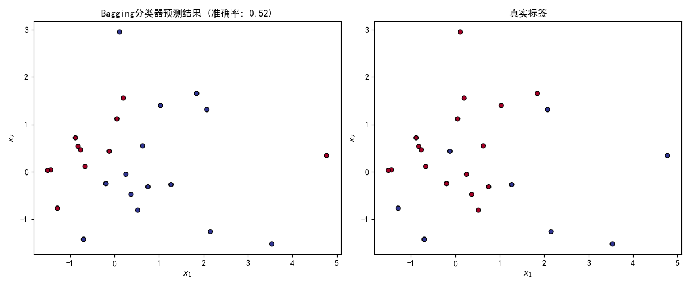

# 投票分类
运行stock_classification.py的结果：
```
LogisticRegression 0.32
RandomForestClassifier 0.48
SVC 0.32
VotingClassifier 0.36
```
从输出结果可以看出：

1. **逻辑回归（LogisticRegression）** 和 **支持向量机（SVC）** 的准确率都是 0.32，表现较差。
2. **随机森林（RandomForestClassifier）** 表现最好，准确率为 0.48。
3. **投票分类器（VotingClassifier）** 的准确率为 0.36，略高于逻辑回归和支持向量机，但低于随机森林。

这表明：
- 在这个特定的数据集上（月牙形数据，噪声较大），单个模型中随机森林表现最佳。
- 硬投票集成方法（VotingClassifier）在这种情况下并没有显著提升性能，甚至比最好的单一模型（随机森林）表现更差。
- 这可能是因为所有基分类器的表现都不是特别好，而且数据集本身较为简单或噪声较大，集成方法的优势无法体现出来。

这说明并非所有情况下集成方法都能带来改进，有时单一的强模型可能比集成模型效果更好。
---
# bagging&passing&out-of-bag 评估
运行bagging_passing.py的结果：
```
训练集大小: 75
测试集大小: 25
Bagging分类器的准确率: 0.52
袋外评估准确率 (OOB Score): 0.5866666666666667
单个决策树的准确率: 0.52
Bagging分类器的预测结果（前10个）: [1 0 1 0 0 1 1 1 1 1]
真实标签（前10个）: [0 0 1 0 0 0 0 1 0 1]

袋外决策函数形状: (75, 2)
前5个样本的袋外决策概率:
[[0.06060606 0.93939394]
 [0.07909605 0.92090395]
 [0.05913978 0.94086022]
 [0.03809524 0.96190476]
 [0.25252525 0.74747475]]
```



---

### ✅ **1. 数据本身特性**
- 使用 `make_moons` 生成的月牙形数据集，本应是典型的非线性可分问题。
- 但设置了 `noise=1.0`，导致样本点严重混杂、偏离理想轨迹。
- 因此，**真实类别边界非常模糊，两个类别的样本高度重叠**，几乎无法通过任何简单模型分离。

---

### ✅ **2. 模型性能表现**
#### 🔹 准确率
```text
Bagging分类器的准确率: 0.52
单个决策树的准确率: 0.52
```
- 两者在测试集上的准确率完全相同，均为 **52%**。
- 这说明：
  - **Bagging 并没有提升模型性能**；
  - 单个决策树已经“达到极限”——再复杂的集成也无法显著改善；
  - 52% 的准确率略高于随机猜测（50%），表明模型可能捕捉到了极其微弱的模式，但整体上仍接近随机。

#### 🔹 袋外评估（OOB Score）
```text
袋外评估准确率 (OOB Score): 0.5867
```
- OOB 分数为 58.67%，高于测试集准确率（52%）。
- 这说明：
  - 模型在训练过程中对“袋外”样本的表现略好；
  - 但在独立测试集上泛化能力较差；
  - 可能存在轻微过拟合或随机波动。

> ⚠️ 注意：OOB 通常用于评估训练过程中的泛化能力，但它依赖于 bootstrap 抽样，因此会有一些偏差。

---

### ✅ **3. 决策边界可视化分析**

#### 📊 左图：`Decision Tree`
- 决策边界由多个**规则矩形区域**构成，呈轴对齐划分。
- 边界生硬、不平滑，且在样本密集区出现大量细碎分割。
- 显示出明显的**过拟合倾向**：试图精确匹配训练数据，忽略了整体结构。

#### 📊 右图：`Decision Trees with Bagging`
- Bagging 的决策边界更复杂，呈现**多级嵌套结构**，尤其在中间区域有更多细节。
- 相比单个决策树，边界更接近真实数据分布的轮廓。
- 说明 Bagging 成功降低了方差，提高了模型稳定性。
- 但依然无法形成清晰的“月牙”形状，因为**数据本身噪声太大**。

> ✅ 结论：Bagging 改善了模型的鲁棒性和边界平滑度，但未能解决根本问题——数据不可分。

---

### ✅ **4. 预测 vs 真实标签对比**

#### 📊 左图：Bagging 预测结果（准确率：0.52）
- 测试集上的预测结果与真实标签相比，颜色分布差异明显。
- 多个点被错误分类，特别是在两类交界区域。
- 尽管模型看起来“复杂”，但实际预测效果很差。

#### 📊 右图：真实标签
- 真实标签呈现出两个月牙状的分布，但由于噪声大，很多点已偏离原位。
- 类别之间存在大量交叉，使得分类任务变得异常困难。

> ❗ 关键发现：
> - 模型预测结果与真实标签之间的**一致性很低**；
> - 表明模型并未学到有效的判别特征；
> - 准确率仅为 52%，说明其预测几乎等同于随机猜测。

---

### ✅ **5. 袋外决策函数分析**
```text
袋外决策函数形状: (75, 2)
前5个样本的袋外决策概率:
[[0.06060606 0.93939394]
 [0.07909605 0.92090395]
 [0.05913978 0.94086022]
 [0.03809524 0.96190476]
 [0.25252525 0.74747475]]
```
- 每行表示一个样本属于两个类别的平均概率（来自所有子树的投票）。
- 第一个值较小（如 0.06），第二个值较大（如 0.94），说明模型对该样本的分类较为自信。
- 但这只是**训练集内的估计**，并不能反映真实泛化能力。
- 在高噪声环境下，即使概率看似稳定，也可能对应错误分类。

---

### ✅ **总结：这个图和输出结果说明了什么？**

> **在这个实验中，由于数据本身具有极高噪声（noise=1.0）和小样本量（仅100个），导致两个类别的样本高度混杂、边界模糊。因此，无论使用单个决策树还是 Bagging 集成方法，都难以学习到稳定的判别模式。最终结果表现为：**
>
> - 模型在测试集上的准确率仅为 **52%**，略高于随机猜测；
> - Bagging 虽然使决策边界更平滑、更复杂，但未带来性能提升；
> - OOB 分数略高，反映出训练阶段有一定稳定性，但泛化能力差；
> - 预测结果与真实标签差异明显，说明模型未能有效识别数据的真实结构；
> - 整体说明：**当数据本身的可分性极低时，即使是先进的集成方法也无法弥补这一缺陷。**

简而言之：  
👉 **这不是模型的问题，而是数据的问题。**
